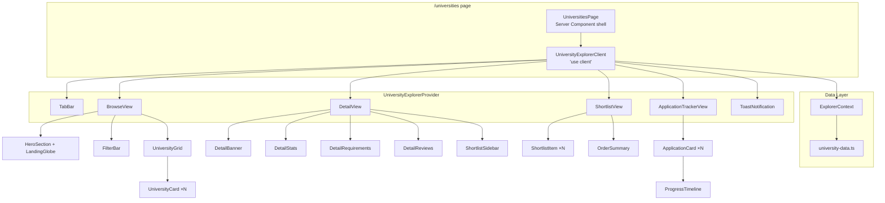
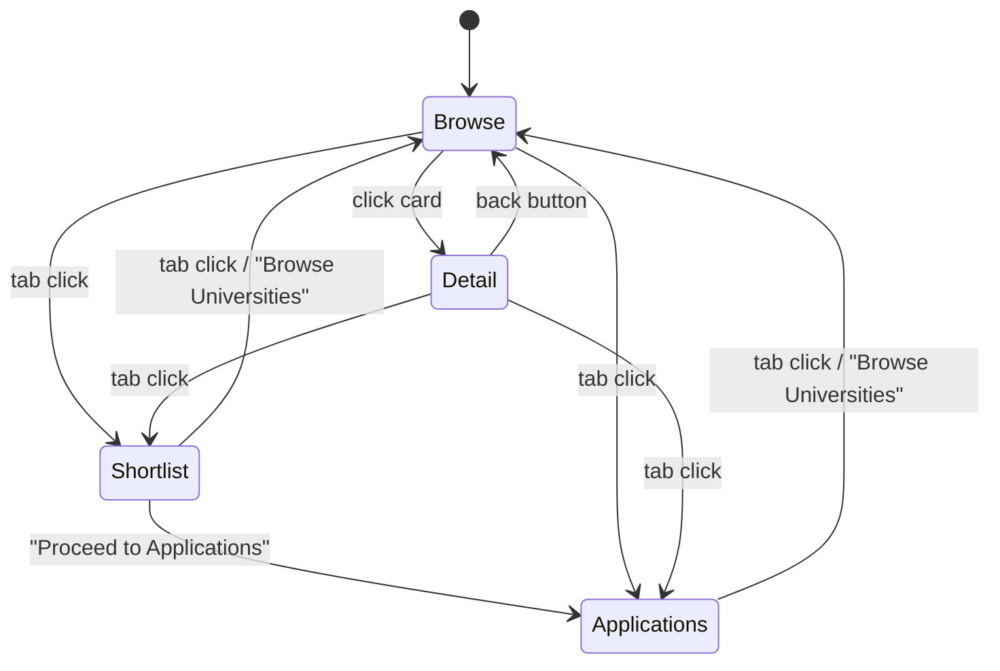

# Design Document: University Explorer

## Overview

The University Explorer replaces the current placeholder `/universities` page with a full-featured university browsing, detail viewing, shortlisting, and application tracking experience. It follows a "shopping for universities" metaphor — students browse university cards, add favourites to a shortlist (cart), proceed to applications (checkout), and track progress through six application stages.

The feature is entirely client-side with static data (no external API). State is managed via React `useState` and `useContext`, persisting only within the browser session. The visual design extends Glowbal's existing dark cosmos theme — deep navy gradients, star field overlays, glassmorphism cards with `backdrop-blur`, and cyan/pink accent colours — already established in the landing page (`design-cosmos.tsx`).

### Key Design Decisions

1. **Single-page with client-side view switching** rather than separate routes. The `/universities` page manages three views (Browse, Shortlist, Applications) via a tab bar and React state. This avoids route-level complexity and keeps shortlist/application state trivially accessible without a global store or URL serialisation.

2. **Static data module** (`src/lib/university-data.ts`) exports typed university records and application stage definitions. This keeps data co-located with other lib modules and makes future migration to an API straightforward — swap the import for a fetch call.

3. **Context-based state** via a `UniversityExplorerProvider` wrapping the page. This holds the shortlist array, applications array, active view, active filter, and toast state. Components consume this context rather than prop-drilling.

4. **Reuse of existing components and patterns**: the `LandingGlobe` component (cosmos theme) is reused in the hero section; GSAP stagger animations mirror the landing page; Tailwind utility classes follow the existing codebase conventions.

5. **No new dependencies**. The project already has `react-globe.gl`, `gsap`, `@gsap/react`, `framer-motion`, `three`, and `tailwindcss`. All UI is built with these plus standard React.

## Architecture



### View State Machine



The active view is one of: `browse`, `detail`, `shortlist`, `applications`. When `detail` is active, a `selectedUniversityId` is also stored in context. The tab bar always shows Browse / Shortlist / Applications; clicking a university card sets the view to `detail`.

## Components and Interfaces

### Data Module — `src/lib/university-data.ts`

```typescript
export interface UniversityReview {
  name: string;
  stars: number;       // 1–5
  text: string;
}

export interface University {
  id: number;
  name: string;
  location: string;
  emoji: string;
  color: string;       // hex, used as banner background tint
  rating: number;      // e.g. 4.9
  reviews: number;     // total review count
  acceptance: string;  // e.g. "17%"
  tags: string[];      // e.g. ["Russell Group", "Global Top 50"]
  rank: string;        // e.g. "#1 UK"
  founded: string;     // e.g. "1096"
  description: string;
  stats: {
    students: string;
    staff: string;
    campuses: string;
  };
  requirements: string[];
  reviewsData: UniversityReview[];
}

export interface ApplicationStage {
  label: string;
  icon: string;        // emoji
  description: string;
}

export const APPLICATION_STAGES: ApplicationStage[] = [
  { label: 'Submitted',           icon: '📨', description: 'Application submitted to UCAS' },
  { label: 'Preparing Documents', icon: '📋', description: 'University reviewing your documents' },
  { label: 'Entry Assessment',    icon: '📝', description: 'Admissions test or written assessment' },
  { label: 'Interview Stage',     icon: '🎤', description: 'Interview invitation — prepare thoroughly' },
  { label: 'Awaiting Decision',   icon: '⏳', description: 'Decision being finalised by admissions' },
  { label: 'Offer Received',      icon: '🎉', description: 'Congratulations — offer in hand!' },
];

export const UNIVERSITIES: University[] = [
  // 12 UK university records (Oxford, Cambridge, Imperial, Birmingham,
  // Edinburgh, Manchester, LSE, Bath, King's College London, Leeds,
  // Royal College of Art, Warwick) — data sourced from HTML demos
];

export const FILTER_CATEGORIES = ['All', 'Russell Group', 'STEM', 'Arts & Humanities', 'Global Top 50'] as const;
export type FilterCategory = (typeof FILTER_CATEGORIES)[number];
```

### Context — `src/lib/explorer-context.tsx`

```typescript
export interface ApplicationEntry {
  universityId: number;
  currentStage: number;  // index into APPLICATION_STAGES (0–5)
  submittedAt: string;   // ISO date string
}

export interface ExplorerState {
  activeView: 'browse' | 'detail' | 'shortlist' | 'applications';
  selectedUniversityId: number | null;
  activeFilter: FilterCategory;
  shortlist: number[];              // university IDs
  applications: ApplicationEntry[];
  toast: { message: string; visible: boolean } | null;
}

export interface ExplorerActions {
  setView: (view: ExplorerState['activeView'], universityId?: number) => void;
  setFilter: (filter: FilterCategory) => void;
  addToShortlist: (id: number) => void;
  removeFromShortlist: (id: number) => void;
  isShortlisted: (id: number) => boolean;
  proceedToApplications: () => void;
  advanceApplication: (universityId: number) => void;
  showToast: (message: string) => void;
}

export const ExplorerContext = createContext<ExplorerState & ExplorerActions>(/* ... */);
```

### Page Component — `src/app/universities/page.tsx`

The server component shell renders the client component:

```tsx
import { UniversityExplorerClient } from './university-explorer-client';

export default function UniversitiesPage() {
  return <UniversityExplorerClient />;
}
```

### Client Component — `src/app/universities/university-explorer-client.tsx`

`'use client'` component that wraps everything in `UniversityExplorerProvider` and conditionally renders the active view. Uses GSAP for entrance animations on the card grid and framer-motion `AnimatePresence` for view transitions.

### UI Components (all in `src/app/universities/` or `src/components/universities/`)

| Component | Props | Responsibility |
|---|---|---|
| `TabBar` | — (reads context) | Three tabs: Browse, Shortlist (with badge count), Applications. Highlights active tab with cyan accent. |
| `HeroSection` | — | Renders `LandingGlobe` (cosmos theme, 500px, 0.4 rotation) behind heading text with gradient overlay. |
| `FilterBar` | — (reads context) | Renders `FILTER_CATEGORIES` as chips. Active chip gets cyan bg. Shows count label. |
| `UniversityGrid` | `universities: University[]` | CSS Grid (`auto-fill, minmax(280px, 1fr)`) of `UniversityCard` components. GSAP stagger fade-up on mount. |
| `UniversityCard` | `university: University` | Glassmorphism card: emoji banner with tinted bg, rank badge, shortlisted badge, name, location, stars, tags, acceptance rate. Hover: `translateY(-4px)` + glow shadow. Click → `setView('detail', id)`. |
| `DetailView` | — (reads context for selected ID) | Two-column layout (main + sidebar). Main: large banner, name, location, rating, description, stats grid, requirements list, review cards. Sidebar: `ShortlistSidebar`. Back button → `setView('browse')`. |
| `ShortlistSidebar` | `university: University` | Sticky sidebar with university name, key stats, "Add to Shortlist" / "Shortlisted" button (green when active), "Save for Later" button. |
| `ShortlistView` | — (reads context) | List of shortlisted universities with remove buttons. Order summary panel with count + "Proceed to Applications" button. Empty state when list is empty. |
| `ApplicationTrackerView` | — (reads context) | Cards for each application with `ProgressTimeline`. "Advance Stage" button. Celebratory banner on final stage. Empty state. |
| `ProgressTimeline` | `currentStage: number` | Six horizontal steps. Completed = green dot + checkmark. Active = cyan dot + glow. Pending = muted dot. Labels below each dot. |
| `ToastNotification` | — (reads context) | Fixed bottom-right. Slide-up animation. Auto-dismiss after 3s. Dark bg, light text, coloured left border. |

## Data Models

### University Record

The 12 university records are hardcoded in `src/lib/university-data.ts`. Each record follows the `University` interface defined above. Data is sourced from the HTML demo files (`uni-shop.html`). The records are:

| # | University | Location | Tags |
|---|---|---|---|
| 1 | University of Oxford | Oxford, UK | Russell Group, Global Top 50 |
| 2 | University of Cambridge | Cambridge, UK | Russell Group, Global Top 50 |
| 3 | Imperial College London | London, UK | Russell Group, STEM, Global Top 50 |
| 4 | University of Birmingham | Birmingham, UK | Russell Group, STEM |
| 5 | University of Edinburgh | Edinburgh, UK | Russell Group, Global Top 50, Arts |
| 6 | University of Manchester | Manchester, UK | Russell Group, STEM, Arts |
| 7 | London School of Economics | London, UK | Russell Group, Global Top 50, Arts |
| 8 | University of Bath | Bath, UK | STEM |
| 9 | King's College London | London, UK | Russell Group, Global Top 50, Arts |
| 10 | University of Leeds | Leeds, UK | Russell Group, Arts |
| 11 | Royal College of Art | London, UK | Arts, Global Top 50 |
| 12 | University of Warwick | Coventry, UK | Russell Group, STEM, Global Top 50 |

### Client State Shape

All state lives in `ExplorerContext`:

- **`shortlist: number[]`** — Array of university IDs. Adding a university appends its ID; removing splices it out. Checked via `includes()`.
- **`applications: ApplicationEntry[]`** — Each entry tracks `universityId`, `currentStage` (0–5 index), and `submittedAt`. Created when user clicks "Proceed to Applications" — all shortlisted IDs become applications at stage 0, and the shortlist is cleared.
- **`activeView`** / **`selectedUniversityId`** — Controls which view renders. `detail` view requires a non-null `selectedUniversityId`.
- **`activeFilter: FilterCategory`** — Controls which universities appear in the grid. `'All'` shows everything; others filter by `university.tags.includes(category)`. The special case `'Arts & Humanities'` matches the tag `'Arts'`.
- **`toast`** — `{ message, visible }` or `null`. Set visible on trigger, auto-cleared after 3 seconds via `setTimeout`.

### Filter Logic

```typescript
function filterUniversities(universities: University[], filter: FilterCategory): University[] {
  if (filter === 'All') return universities;
  const tag = filter === 'Arts & Humanities' ? 'Arts' : filter;
  return universities.filter(u => u.tags.includes(tag));
}
```

### Application Stage Advancement

```typescript
function advanceApplication(applications: ApplicationEntry[], universityId: number): ApplicationEntry[] {
  return applications.map(app =>
    app.universityId === universityId && app.currentStage < APPLICATION_STAGES.length - 1
      ? { ...app, currentStage: app.currentStage + 1 }
      : app
  );
}
```

### Shortlist Management

```typescript
function addToShortlist(shortlist: number[], id: number): number[] {
  if (shortlist.includes(id)) return shortlist;
  return [...shortlist, id];
}

function removeFromShortlist(shortlist: number[], id: number): number[] {
  return shortlist.filter(x => x !== id);
}
```

### Proceed to Applications (Checkout)

```typescript
function proceedToApplications(
  shortlist: number[],
  existingApplications: ApplicationEntry[]
): { applications: ApplicationEntry[]; clearedShortlist: number[] } {
  const newApps = shortlist
    .filter(id => !existingApplications.some(a => a.universityId === id))
    .map(id => ({
      universityId: id,
      currentStage: 0,
      submittedAt: new Date().toISOString(),
    }));
  return {
    applications: [...existingApplications, ...newApps],
    clearedShortlist: [],
  };
}
```

