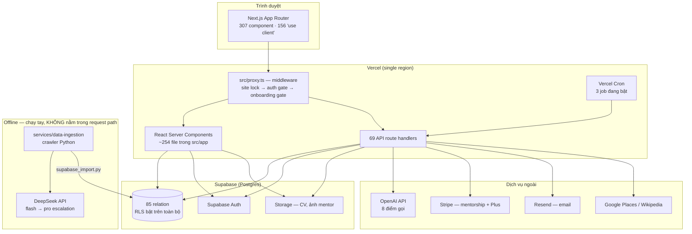

# TECH_SOLUTION.md

Tài liệu này mô tả **giải pháp kỹ thuật GlowBal đang thực sự chạy** (không phải
giải pháp trong pitch deck), lý do đằng sau từng quyết định, và định hướng nâng
cấp. Viết ngày **2026-08-03**, dựa trên đọc code + truy vấn trực tiếp database
production, không dựa vào tài liệu cũ.

> **Nguyên tắc của file này: code thắng.** Chỗ nào tài liệu (kể cả pitch deck)
> nói khác code, file này ghi lại cả hai và nói rõ cái nào là thật. Phần
> [§3 Khoảng cách](#3-khoảng-cách-giữa-câu-chuyện-và-code) tồn tại chính vì mục
> đích đó.
>
> Rủi ro chi tiết + effort ước tính: xem [docs/audit-2026-08-03.md](docs/audit-2026-08-03.md).

---

## 1. Hệ thống hiện tại

### 1.1 Sơ đồ runtime



**Điểm quan trọng nhất của sơ đồ này:** khối `off` (crawler Python + DeepSeek)
**không nối vào request path**. Nó là một pipeline batch chạy tay, ghi kết quả
xuống Postgres; ứng dụng đọc lại từ Postgres. Không có lời gọi runtime nào từ
Next.js sang Python hay sang DeepSeek.

### 1.2 Số liệu

| Hạng mục | Số đo |
|---|---|
| TypeScript/TSX | 114.451 dòng · 659 file |
| Phân bổ | `app/` 46.3k · `features/` 29.7k · `lib/` 19.4k · `components/` 10.6k · `shared/` 6.9k · `server/` 0.5k |
| API routes | 69 |
| Relation live trong DB | 85 (70 có migration trong repo, **18 không có**) |
| Migration | 48 file `supabase-*.sql`, chạy tay, không có runner/version table |
| Test | 1.233 unit test pass · 76 suite · 7 Playwright spec |
| Coverage ratchet | lines 60 / functions 54 / branches 55 / statements 60 |
| Điểm gọi model | 8 (3 qua SDK, **5 tự viết `fetch` thô**) |
| `createAdminClient()` | **85 điểm gọi** trên ~50 file |

---

## 2. Các quyết định kiến trúc, và lý do

### 2.1 Feature-Sliced Design, ép bằng ESLint — **giữ**

`eslint.config.mjs` ép 6 ranh giới bằng `no-restricted-imports`, cộng
`tsconfig.strict.json` (`noUncheckedIndexedAccess`, `exactOptionalPropertyTypes`)
cho code mới dưới `features/`, `shared/`, `server/`.

**Vì sao đúng:** ranh giới kiến trúc chỉ tồn tại nếu có máy kiểm. Ở đây nó là
lint error, chạy trong CI. Danh sách `ADMIN_CLIENT_DEBT` ("chỉ được co lại, không
được phình ra") là một cơ chế hay: nó biến technical debt thành thứ CI đếm được,
chứ không phải một dòng TODO.

**Giới hạn hiện tại:** `src/app` (46k dòng) và `src/lib` (19k dòng) là code
pre-FSD, chiếm **57% codebase** và không chịu ranh giới nào. Đây là nơi tập trung
gần hết rủi ro trong báo cáo audit.

### 2.2 Repository port + test seam — **giữ và mở rộng**

`UniversityQueries` / `ScholarshipQueries` / `ProgrammeQueries` là interface,
adapter Supabase nằm sau `setUniversityQueries()`. UI import **kiểu port**, không
import adapter.

**Vì sao đúng:** đây là thứ khiến 1.233 test chạy được trong 7 giây mà không cần
database. Ba feature mới nhất (universities, scholarships, apply) đều theo mẫu
này. Cần nhân rộng sang mentorship và apply-workspace — hai chỗ còn gọi thẳng
Supabase từ page component.

### 2.3 Đọc dữ liệu qua service role — **cần đảo ngược, đây là nợ lớn nhất**

Đây là quyết định gây hệ quả sâu nhất trong codebase, và nó **không được ghi ở
đâu như một quyết định** — nó lan ra dần.

Sự thật đo được ngày 03/08:

- RLS **bật trên toàn bộ 85 relation**, và policy hoạt động đúng. Quét bằng anon
  key: 62 bảng có dữ liệu và trả về **0 dòng** cho khách vãng lai. Không rò rỉ
  PII sinh viên nào — `student_profiles`, `personal_statements`,
  `uploaded_documents`, `applicant_analyses`, `course_applications`,
  `english_test_scores`, `user_entitlements`, `plus_subscriptions` đều kín.
- Nhưng ứng dụng **hầu như không dùng RLS đó**. `universities` (106 dòng) và
  `scholarships` (2.877 dòng) cũng chặn anon, nên mọi trang công khai phải đọc
  qua `createAdminClient()` — service role, bypass RLS. Có **85 điểm gọi**.

**Hệ quả:** RLS là hàng rào thật nhưng phần lớn bị đi vòng. Cách ly dữ liệu giữa
sinh viên A và B hiện phụ thuộc vào **lập trình viên nhớ viết `.eq('user_id',
user.id)`** ở 85 chỗ. Hôm nay các chỗ tôi kiểm tra đều đúng. Nhưng đây là loại
đảm bảo mất dần theo thời gian, và một lần quên là rò rỉ chéo.

`src/lib/mentors.ts` đã ghi lại đúng 4 quy tắc cần có khi buộc phải dùng service
role (lọc trong query, project sang type công khai, validate id, mirror luật
write-side). **Bốn quy tắc đó cần thành luật chung**, không phải ghi chú của một
file.

**Vì sao nó xảy ra:** vì thiếu policy `anon` read cho dữ liệu công khai. Sửa
đúng là thêm policy, không phải thêm service role.

### 2.4 Structured output: schema + coercion — **giữ, nhưng đang không đồng nhất**

Codebase có **hai chuẩn** cho cùng một việc, và chỉ một cái tốt.

| Chuẩn | Ở đâu | Đặc điểm |
|---|---|---|
| **Tốt** | `src/lib/ai/strategy/call.ts`, `src/lib/course-parser/extract-course.ts` | SDK, timeout tường minh, `json_schema strict` hoặc `json_object`, **coercion từng field** (`asString`, `asScore`, `asEnum`…), tagged result phân biệt `not_configured` / `provider_failed` / `bad_response` |
| **Yếu** | 5 route tự viết `fetch` thô | không timeout, `JSON.parse()` rồi dùng thẳng, **không validate schema** |

`call.ts` có comment giải thích chính xác vì sao wrapper tồn tại: *"Năm call site
cần hành vi giống hệt nhau ở đường lỗi… Năm bản sao sẽ đồng ý hôm nay và lệch
nhau trong một tháng."* Nhận định đó đúng — và **đã xảy ra**: có 5 bản sao khác
không dùng wrapper này.

Trường hợp xấu nhất là `/api/ai/analyze-statement`:

```ts
const analysis = JSON.parse(cleaned);
return NextResponse.json({ ...analysis, limited: !isPlus });
```

Output của model được spread thẳng ra client, không kiểm một field nào. Đây đúng
là "tin tưởng mù model" — và nó nằm ở SOP Feedback, một trong bốn tính năng lõi.

### 2.5 Job queue trên Postgres — **giữ kiến trúc, sửa vận hành**

`claim_course_parse_jobs` dùng `FOR UPDATE SKIP LOCKED`, exponential backoff
`attempts² × 5 phút`, `max_attempts`.

**Vì sao đúng:** không cần thêm Redis/SQS cho tải hiện tại. Đây là lựa chọn đúng
cho giai đoạn này.

**Ba lỗi vận hành:**

1. **Timeout lồng ngược.** `AI_TIMEOUT_MS = 60_000` trong `extract-course.ts`
   nhưng route cron `maxDuration = 60`, và xử lý **5 job song song** trong một
   lần chạy. Timeout bên trong không bao giờ kịp bắn trước khi Vercel giết
   function. (`call.ts` đặt 45s và ghi rõ *"below the 60s maxDuration"* — đúng
   cách; `extract-course.ts` thì không.)
2. **Không có reaper.** Query claim chỉ nhìn `status = 'pending'`. Job bị giết
   giữa chừng nằm `processing` vĩnh viễn.
3. **Trần thông lượng 300 job/giờ.** Cron `* * * * *` × batch 5.

### 2.6 Migration bằng file `.sql` chạy tay — **phải thay**

48 file `supabase-*.sql`, không thứ tự, không bảng version, chạy tay trong
Supabase SQL editor.

Hậu quả đo được: **18 relation đang chạy production không có migration nào trong
repo**, gồm những thứ không hề phụ: `course_parse_jobs` (hàng đợi của Smart Course
Importer), `course_search_sessions`, `user_entitlements` (371 dòng — cổng tính
phí), `catalog_programmes` (404 dòng — subject picker).

**Hai hệ quả nghiêm trọng:**

- Không thể dựng lại môi trường từ repo. `npm ci && npm run build` cho ra một app
  hỏng.
- **Không thể review bảo mật những bảng đó.** RLS posture của hàng đợi và bảng
  entitlement không nằm trong version control. (Tôi đã kiểm trực tiếp: chúng
  *đang* enforce RLS đúng. Nhưng điều đó được biết bằng cách truy vấn production,
  không bằng cách đọc repo.)

`docs/known-issues.md §0` đã ghi lại đúng cái bẫy `ADD COLUMN IF NOT EXISTS`
không đổi được kiểu cột — bẫy đó là triệu chứng của việc thiếu migration runner,
không phải nguyên nhân gốc.

### 2.7 Site lock + auth gate hai tầng — **giữ**

`src/lib/site-gate.ts` làm đúng: sha256 của `secret:password`, `timingSafeEqual`,
**fail closed** khi thiếu env. Cookie không chứa password. Xoay env là logout toàn
bộ.

Auth thì phòng thủ nhiều lớp: `/admin` được chặn ở `src/app/admin/layout.tsx`
(server component) chứ không chỉ ở middleware — nên các CVE bypass middleware của
Next 16.2.3 không mở được cửa admin. `/profile`, `/dashboard` cũng tự kiểm lại.

### 2.8 Stripe: webhook cho mentorship, redirect-fulfilment cho Plus — **bất đối xứng, cần thống nhất**

| Luồng | Cơ chế | Đánh giá |
|---|---|---|
| Mentorship | Webhook `/api/mentorship/webhook`, `constructEvent` verify chữ ký, idempotent, trả 500 để Stripe retry | **Đúng chuẩn** |
| Plus | Fulfil trên trang `/plus/success`, verify bằng `sessions.retrieve` + `client_reference_id === user.id`, idempotent theo `stripe_reference` | **Không tự-cấp được, nhưng mất tiền nếu redirect hỏng** |

Plus không có webhook và không có job đối soát. Sinh viên trả tiền rồi đóng trình
duyệt trước khi redirect về ⇒ Stripe thu tiền, tài khoản không được nâng cấp,
không có gì phát hiện. Đường cứu hộ duy nhất là dòng chữ "liên hệ
hello@glowbal.com" — mà domain đó **không phải domain thật** của sản phẩm
(`glowbal-education.com`).

---

## 3. Khoảng cách giữa câu chuyện và code

Phần này tồn tại để không ai — kể cả nhà đầu tư hay ban giám khảo — đọc pitch deck
rồi tin vào một cơ chế không có trong code.

### 3.1 Không có model self-hosted, và không có fallback

Đã tìm toàn repo (`src`, `scripts`, `services`) các từ khoá: `ollama`, `llama`,
`vllm`, `lm studio`, `self-host`, `mac mini`, `localhost:11434`, `baseURL`,
`OPENAI_BASE_URL`. **Không có kết quả nào.**

Sự thật:

- `src/lib/ai/openai-client.ts` khởi tạo SDK với baseURL mặc định →
  `api.openai.com`. Không có endpoint thay thế nào cấu hình được.
- Cả 8 điểm gọi model trong request path đều đi thẳng OpenAI.
- Khi OpenAI hỏng, hành vi **tốt nhất** trong codebase là trả reason code để route
  map sang 503 (`call.ts`). Không có provider thứ hai để chuyển sang.
- DeepSeek **có** trong repo — nhưng ở `services/data-ingestion`, một crawler
  Python chạy tay, gọi `https://api.deepseek.com` (cũng là API hosted, không phải
  self-host), và **không nằm trong request path của người dùng**.

Vì vậy câu hỏi *"Mac mini self-host có nghẽn cổ chai khi traffic tăng 10x không"*
**không áp dụng được**: không có Mac mini nào trong đường đi của request. Và phát
biểu *"người dùng không bao giờ thấy lỗi"* hiện **không đúng** — OpenAI hỏng thì
người dùng thấy lỗi.

Điểm tích cực: `services/data-ingestion` cho thấy nhóm **biết** cách làm ladder
nhiều model đúng cách — `deepseek.py` có escalation flash→pro, retry, cache theo
content hash, `max_llm_retries`. Kiến thức đã có; nó chỉ chưa được mang sang phía
Next.js.

### 3.2 Tầng observability là file rỗng

```ts
// src/server/observability/index.ts
/** Structured logging, timing, and error reporting for server-side code. */
export {};
```

Toàn bộ xử lý lỗi thực tế là **185 lời gọi `console.error`**. Không Sentry, không
structured logging, không alerting, không error budget. Khi OpenAI hỏng hoặc
Supabase hỏng lúc 2 giờ sáng, **không ai được báo** — sự cố chỉ lộ ra khi có sinh
viên phàn nàn.

Bằng chứng cụ thể cho việc này tốn tiền thật: **13 application đang kẹt
`parse_status = 'pending'` mà không có job nào tồn tại**, cũ nhất từ
**2026-06-15** — tức gần 7 tuần. Sinh viên thấy "GlowBal's AI is reading the
course page…" mãi mãi. Script sửa đã có sẵn
(`scripts/repair-stranded-applications.mjs`) nhưng chưa chạy. Không ai biết vì
không có gì báo.

### 3.3 Rate limiting là in-memory, nên trên serverless gần như không có tác dụng

`src/lib/rate-limiter/rate-limiter.ts` dùng `Map` trong process, các limiter là
singleton module-scope. Trên Vercel mỗi lambda instance có bộ nhớ riêng ⇒ giới hạn
"8 request/phút" thực tế là "8 × số instance đang chạy". Chính file đó ghi *"For
production with multiple server instances, consider replacing with Redis-based
rate limiting"* — ghi chú đúng, chưa làm.

Và nó chỉ được áp cho **6 trong 69 route**.

---

## 4. Định hướng

Ba giai đoạn, xếp theo *rủi ro giảm được trên mỗi giờ công*, không theo độ hấp dẫn
kỹ thuật.

### Giai đoạn 1 — Bịt lỗ hổng (1–2 tuần)

Mục tiêu: không còn đường nào cho người lạ tiêu tiền hoặc mượn hạ tầng của GlowBal.

1. **Đóng `/api/translate` và `/api/newsletter/notify`.** Cả hai đang mở cho người
   chưa đăng nhập; cái sau `fail-open` khi thiếu env.
2. **Chặn SSRF ở Course Importer.** Port `services/data-ingestion/url_safety.py`
   sang TypeScript — logic đã viết đúng rồi, chỉ cần dùng ở phía Next.
3. **Nâng Next lên 16.2.12** (`npm audit fix --force`; vẫn trong 16.2.x).
4. **Rate limit + giới hạn độ dài input** trên mọi route gọi model.
5. **Chạy `scripts/repair-stranded-applications.mjs`**, giải phóng 13 application.

### Giai đoạn 2 — Làm cho hệ thống nói được nó đang hỏng (2–4 tuần)

6. **Hiện thực `src/server/observability`.** Sentry (hoặc Axiom) + structured
   log. Thư mục đã có, chỉ rỗng.
7. **Một cổng model duy nhất.** Gộp 5 client `fetch` thô về `callStrategyModel`,
   mở rộng nó thành `AiGateway` có: timeout, retry + jitter, circuit breaker,
   **provider ladder**, và validate Zod bắt buộc trước khi ghi DB/render.
8. **Webhook cho Plus** + cron đối soát Stripe, xoá luôn mọi `hello@glowbal.com`.
9. **Migration runner.** Supabase CLI, đưa 18 relation mồ côi vào version control.

### Giai đoạn 3 — Chuẩn bị cho 10x (1–2 tháng)

10. **Đảo chiều truy cập dữ liệu**: thêm policy `anon` read cho dữ liệu công khai,
    rút dần 85 điểm `createAdminClient()`, đưa `ADMIN_CLIENT_DEBT` về gần 0.
11. **Rate limit phân tán** (Upstash Redis).
12. **Tách worker khỏi cron** để vượt trần 300 job/giờ.
13. **Dọn ~4.000 dòng code chết**, gỡ `react-globe.gl` + `three` + `gsap`.

### Đánh giá thật về khả năng scale 10x

| Thành phần | Trần hiện tại | Vỡ ở đâu trước |
|---|---|---|
| Next.js trên Vercel | Tự co giãn | Không phải nút thắt |
| Supabase Postgres | 128 index, query đã lọc theo khoá | Connection pool ở tier thấp |
| **Course parse queue** | **300 job/giờ** | **Nút thắt cứng đầu tiên** |
| **OpenAI** | Rate limit theo tài khoản, **không fallback** | **Điểm chết đơn lẻ của mọi tính năng AI** |
| Rate limiter | Per-instance | Càng scale càng vô hiệu |

Nút thắt thật **không phải phần cứng** — không có Mac mini nào trong request path.
Nó là **hàng đợi parse** và **sự phụ thuộc một nhà cung cấp model duy nhất**.

---

## 5. Bảng quyết định

| Quyết định | Trạng thái | Lý do |
|---|---|---|
| FSD + ESLint boundaries | **Giữ** | Ranh giới có máy kiểm mới là ranh giới |
| Repository port + test seam | **Giữ, mở rộng** | 1.233 test chạy 7s không cần DB |
| `tsconfig.strict.json` cho code mới | **Giữ** | Bắt được cả lớp lỗi index/optional |
| Job queue trên Postgres | **Giữ**, sửa timeout + reaper | Đúng cho quy mô này; chưa cần Redis |
| Site gate sha256 + fail-closed | **Giữ** | Làm đúng chuẩn |
| Webhook mentorship | **Giữ**, nhân sang Plus | Verify chữ ký + idempotent |
| Structured output có coercion | **Giữ**, áp cho toàn bộ | Đang chỉ áp 3/8 điểm gọi |
| 5 client OpenAI tự viết | **Bỏ** | Không timeout, không validate |
| Service-role-first data access | **Đảo ngược** | RLS tốt nhưng đang bị đi vòng ở 85 chỗ |
| Migration `.sql` chạy tay | **Thay** | 18 relation ngoài version control |
| Rate limiter in-memory | **Thay** | Vô hiệu trên serverless |
| `src/server/observability` rỗng | **Hiện thực** | 7 tuần lỗi im lặng là bằng chứng |
| `gsap`, `@gsap/react` | **Gỡ** | 0 import trong toàn repo |
| `react-globe.gl`, `three` | **Gỡ** sau khi dọn code chết | Còn đúng 1 consumer sống |
