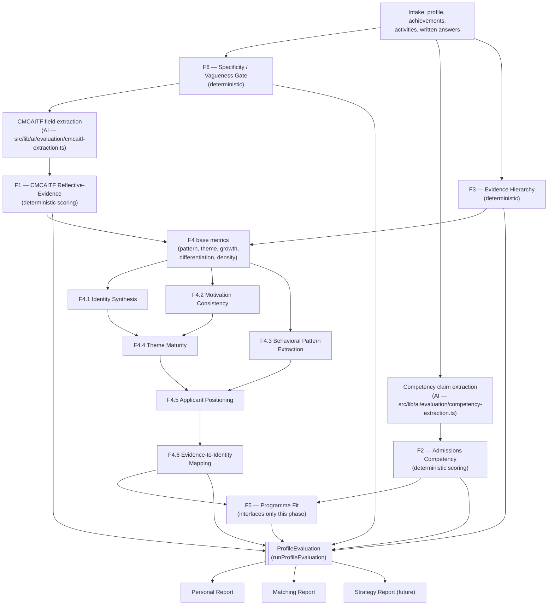

# GlowBal Shared Evaluation Engine

One canonical implementation of the F1–F6 evaluation frameworks, consumed by
the Personal Report, the Matching Report, and (later) the Strategy Report —
so the three surfaces cannot disagree about the same student's own profile.

Code: `src/shared/evaluation/` (pure, deterministic domain logic) and
`src/lib/ai/evaluation/` (the two genuinely-semantic extraction steps this
engine needs). Migration: `supabase-shared-evaluation-engine.sql`.

## Why this exists

Before this module, three different implementations touched frameworks with
the same F1–F6 names and scored different things:

- `src/features/ai-strategy-dashboard/domain/evaluation/` implemented F1–F6
  but F2 was a straight relabelling of match-insights' five document-quality
  pillars (academic/activities/essays/impact/personal), not demonstrated
  competencies, and F3 scored tier+reach rather than the canonical
  tangible/intangible/traceability metrics.
- `src/lib/ai/match-insights.ts` scored five pillars for the Matching Report
  with no relationship to F1–F4 at all.
- `src/lib/ai/personal-report.ts` / `src/features/apply/domain/ai-reports.ts`
  generated a narrative report with its own evidence model, again
  independent of the above.

Three systems that can each individually claim to implement "the framework"
while scoring different things is the exact failure this phase closes.

## The ten core principles

1. **Evidence first.** Every score traces to something the student entered.
2. **Never invent missing applicant facts.**
3. **Observation / Inference / Missing are always distinguished** — every
   `Insight` carries an explicit `kind: ObservationKind`.
4. **Assumptions are never allowed in scoring.** A model's own claim about
   how well-grounded its output is is never trusted at face value — F2's
   `scoreGroundedness` and F4's synthesis-readiness gates independently
   verify what an extractor proposes.
5. **Every important inference has evidenceRefs + confidence.**
6. **Missing metrics become N/A, and weights are renormalized** —
   `weightedScore()` is the one implementation of this rule, shared by F1,
   F2, F3 and F4's base metrics.
7. **Never compute an admissions probability.** Nowhere in this engine does
   a number represent a chance of admission — F5's classification
   (safety/match/reach/currently_ineligible/insufficient_data) is the
   closest concept, and it is explicitly a categorical band, not a
   probability.
8. **Deterministic logic stays deterministic.** Every framework file states
   in its header whether it needs a model, and only F1's CMCAITF
   extraction and F2's competency-claim extraction do.
9. **LLM calls only handle genuinely semantic judgement/extraction** — never
   arithmetic, never the final score.
10. **Structured results are stored, not only prose** — `ProfileEvaluation`
    is the record; prose is a rendering of it.

## Pipeline



## What is AI and what is not

| Framework | Needs a model? | Why |
|---|---|---|
| F6 Vagueness Gate | No | Text-property heuristics (length, generic openings, concrete markers) — testable, deterministic, and a student who disagrees can see exactly what triggered a finding. |
| F1 CMCAITF Reflective-Evidence | Extraction only | Splitting free text into seven CMCAITF slots is genuinely semantic (`cmcaitf-extraction.ts`). Scoring the five metrics from whatever slots exist is deterministic (`f1-reflection.ts`). |
| F2 Admissions Competency | Extraction only | Recognising which skill a piece of evidence demonstrates, and writing the grounding sentence, is semantic (`competency-extraction.ts`). Scoring how well-grounded that claim actually is — and therefore trusting or discounting it — is deterministic and independent of the model's own claim (`f2-competency.ts`). |
| F3 Evidence Hierarchy | No | Quality and verification status are properties of structured fields the student already entered (a document attached, a number stated, an organisation named). |
| F4 (base + F4.1–F4.6) | No, in this phase | Every sub-framework here operates on structured `NarrativeActivity` records with a `role`/`behaviour`/`domainTheme`/`statedMotivation`/`outcome` shape. Composing the final natural-language sentence ("A builder who repeatedly turns student needs into practical initiatives") from this structured output is left to a future rendering layer; nothing in `f4-narrative-identity.ts` calls a model. |
| F5 Programme Fit | Not built | Interfaces only — see below. |

## F1 — CMCAITF Reflective-Evidence Framework

CMCAITF = Context, Motivation, Challenge, Action, Impact, Transformation,
Future. The product does not capture all seven fields for every
activity/achievement today (the Achievements form has one free-text
`detail`, not seven prompts). `f1-reflection.ts` does not fake the missing
six — each of the five metrics below is scored from whichever CMCAITF fields
actually exist, and reported `null` when there is nothing to score it from.

```
F1 = 0.25·Specificity + 0.20·Completeness + 0.20·CausalClarity
   + 0.15·PersonalVoice + 0.20·TransformationDepth
```

Every metric is internally 1–5, rescaled to 0–100 so F1 sits on the same
scale as the rest of the engine. `weightedScore()` renormalizes across
whichever metrics were assessable for a given record — a record with only a
title and one paragraph gets a `limited` status and fewer scored metrics,
never a fabricated middle score to fill a gap.

## F2 — Admissions Competency Framework

**Not a relabelling of the five Matching pillars.** F2 evaluates
demonstrated, evidence-grounded competencies:

```
F2 = 0.30·HardSkillSpecificity + 0.35·SoftSkillSpecificity + 0.35·MetaSkillSpecificity
```

A skill must be grounded in a concrete situation — `"leadership"` alone
scores 20/100 (a bare trait label); a described situation with a linked
evidence record can reach 90/100. The AI extractor proposes claims; the
scoring function independently checks whether the proposed `situation` text
actually contains a concrete detail and whether `evidenceRefs` backs it —
the model's own confidence in its output is never trusted at face value.

## F3 — Evidence Hierarchy Framework

```
F3 = 0.40·TangibleImpactQuantification + 0.30·IntangibleImpactArticulation + 0.30·EvidenceTraceability
```

F3 returns **two separate outputs**, never merged into one number:

- **A. Quality** — the three metrics above, describing how well the impact
  of a piece of evidence is articulated.
- **B. Verification status** — `verified` (a document is attached) /
  `attributable` (a named external body, no document) / `stated` (the
  student's word alone), plus a parsed `reach` band. A piece of evidence can
  be high-quality and unverifiable, or low-quality and fully verified;
  collapsing the two would hide which one a student needs to fix.

## F4 — Narrative Identity & Personal Branding Framework

F4 synthesises **across** activities, never from one. Every sub-framework
respects the same evidence-count floor:

| Activity count | Readiness |
|---|---|
| 0 | none — nothing to synthesise |
| 1 | insufficient — cannot establish a recurring pattern |
| 2 | emerging — supports a candidate, not-yet-mature pattern |
| 3+ | mature — a full synthesis |

Base metrics (health check on whether there is enough material, not a
duplicate of F4.1–F4.6):

```
F4(base) = 0.25·PatternConsistency + 0.20·ThematicConvergence
         + 0.20·GrowthArc + 0.20·Differentiation + 0.15·EvidenceDensity
```

**F4.1 Identity Synthesis** — recurring role + recurring behaviour + value
orientation, output as behaviour ("a builder who…"), never adjectives
("passionate leader").

**F4.2 Motivation Consistency** — statuses `established` / `emerging` /
`hypothesis` / `insufficient`. **Never infers an internal motivation as fact
from repeated activity choice alone** — repetition with nothing ever
explicitly stated caps at `hypothesis`; `established` requires the student
to have said their motivation, more than once, with a mature (3+) synthesis
behind it.

**F4.3 Behavioral Pattern Extraction** — Trigger → Response → Method → Value
created. Only fills the four slots from repeated evidence; one activity
never establishes a pattern.

**F4.4 Theme Maturity** — a theme is a problem/domain ("Education access"),
never a competency ("Leadership"). Statuses `established_theme` /
`strong_emerging_theme` / `early_signal` / `possible_theme`, from evidence
counts and explicit/implicit linkage.

**F4.5 Applicant Positioning** — Identity + Signature strength + Theme +
Intended direction, assessed for authenticity, differentiation, coherence,
direction alignment and credibility. Composes only from what F4.1/F4.3/F4.4
already established; adds no new inference of its own.

**F4.6 Evidence-to-Identity Mapping** — every major identity claim maps back
to a proof: activity, role, personal contribution, outcome, competencies
demonstrated, evidence strength, and evidence source IDs. A proof with no
linked evidence is `limited` by construction.

## F5 — Programme Fit Framework

Interfaces only in this phase (`f5-programme-fit.ts`) —
`buildProgrammeFitPlaceholder()` always returns `not_available` for every
dimension and `insufficient_data` for the classification. The shape matches
the existing `programmeFitSchema` in `src/features/apply/domain/ai-reports.ts`
so nothing downstream has to be restructured when F5 is implemented in the
Matching Report phase.

## F6 — Specificity / Vagueness Gate

Grades, does not block. Every reason (`missing`, `too_short`,
`generic_opening`, `no_concrete_actors`, `no_concrete_actions`,
`no_concrete_outcomes`) is a deterministic property of the text. Where a
field is weak or empty, `clarificationPrompt` carries a targeted follow-up
question — never a fabricated answer on the student's behalf.

## Data model

`ProfileEvaluation` (`src/shared/evaluation/engine.ts`) is the top-level
domain object:

```ts
type ProfileEvaluation = {
  subjectId: string;
  vagueness: VaguenessReport;          // F6
  reflection: ReflectionProfile;        // F1
  competencies: CompetencyProfile;      // F2
  evidence: EvidenceProfile;            // F3
  narrativeIdentity: {                  // F4 + sub-frameworks
    base: NarrativeBaseMetrics;
    readiness: SynthesisReadiness;
    identity: IdentitySynthesis;        // F4.1
    motivation: MotivationConsistency;  // F4.2
    pattern: BehavioralPatternResult;   // F4.3
    positioning: ApplicantPositioning;  // F4.5
  };
  programmeFit: ProgrammeFitResult;     // F5 (placeholder)
  confidence: Confidence;               // floor across every framework
  generatedAt: string;
};
```

Every scoring result extends the common `Insight` shape:

```ts
type Insight = {
  id: string;
  frameworkId: FrameworkId;
  status: string;
  score?: number | null;              // omitted/null for fundamentally qualitative outputs
  confidence: 'high' | 'medium' | 'low';
  kind: 'observation' | 'inference' | 'missing';
  evidenceRefs: EvidenceRef[];
  limitations: string[];
  missingInputs: string[];
};
```

## Database

`supabase-shared-evaluation-engine.sql` extends the existing report tables
rather than adding a parallel one:

- `student_personal_reports.structured_evaluation` (JSONB) — the
  `ProfileEvaluation` behind the global Personal Report.
- `student_personal_reports.evaluation_engine_version` — versions the
  deterministic scoring code, independent of `prompt_version` (which already
  versions the AI call text).
- `applicant_analyses.structured_evaluation` / `.evaluation_engine_version` /
  `.input_hash` — the same shape for the per-application analysis that will
  back the Matching/Strategy Report.

Regeneration is idempotent via `shouldRegenerate()`
(`src/shared/evaluation/versioning.ts`): a caller skips generation entirely
when the stored row's `input_hash` and `evaluation_engine_version` both
match the current input and the engine's current `ENGINE_VERSION`.

## Testing

87 tests across `src/shared/evaluation/*.test.ts` and
`src/lib/ai/evaluation/*.test.ts`, covering (per framework, deterministic
logic tested directly; AI extraction tested with mocked completions):

- Vague input, missing input, and confidence behaviour (F6).
- The F1/F2/F3/F4 formulas, with their exact published weights asserted.
- Missing-metric handling and renormalization (`weightedScore`) at every
  framework.
- The activity-count pattern rule explicitly: one activity cannot establish
  a pattern, two create an emerging pattern, three or more establish a
  mature synthesis (F4 and all its sub-frameworks).
- An evidence-backed claim scoring higher than an unsupported/bare one (F2),
  and an unsupported inference never being silently accepted as established
  (F4.2's motivation-from-repetition rule).
- Purity: the same `ProfileEvaluation` input twice produces an identical
  result.
- No admissions probability ever appears anywhere in a serialized result.

Run with `npx vitest run src/shared/evaluation src/lib/ai/evaluation`.
