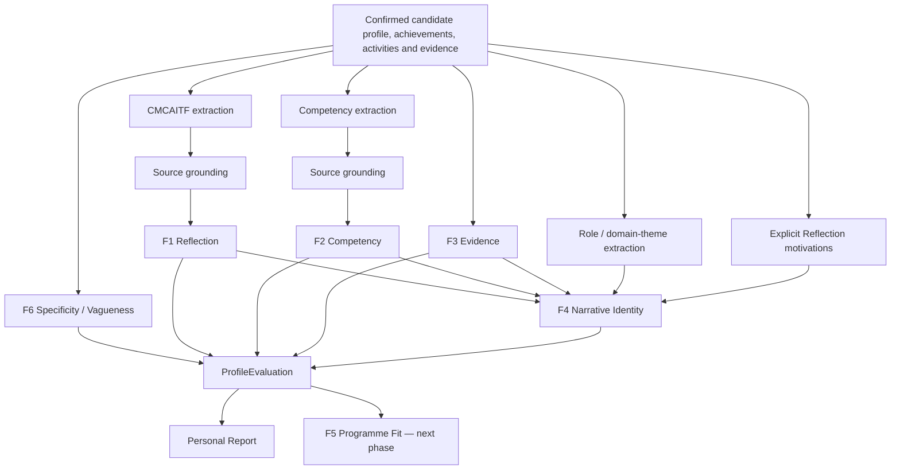

# GlowBal Shared Evaluation Engine

The Shared Evaluation Engine is the canonical **user-level** evaluation of a student's own profile. It produces one `ProfileEvaluation`, which the Personal Report renders and later application-level products reuse.

The central ownership rule is:

```text
student evidence
  → F6 / F1 / F2 / F3 / F4
  → ProfileEvaluation
  → Personal Report

ProfileEvaluation + programme evidence
  → F5
  → Matching Report

ProfileEvaluation + F5 gaps
  → F7
  → Strategy Report
  → Planner
```

F1–F4 must not be regenerated independently for every university application.

## Code boundaries

- `src/shared/evaluation/` — pure framework/domain logic and deterministic scoring.
- `src/lib/ai/evaluation/` — semantic extraction from free text.
- `src/lib/ai/personal-report-v2.ts` — orchestration and post-model source grounding.
- `src/features/apply/domain/personal-report.ts` — deterministic six-section Personal Report rendering.
- `src/app/api/ai-strategy/personal-report/route.ts` — authenticated generation/caching/persistence seam.
- `supabase-shared-evaluation-engine.sql` — user-level storage migration.

## Core rules

1. **Evidence first.** Scores and factual findings must trace to student-entered/profile/document records.
2. **No invented missing facts.** Missing information remains missing.
3. **Observation, inference and missing data are different states.**
4. **Model output does not validate itself.** Factual extracted prose is checked against the source text before it reaches scoring.
5. **Important inferences carry evidence references, confidence and limitations.**
6. **Missing score dimensions are `null`, not zero.** Applicable weights are renormalized.
7. **No admission probability is produced.**
8. **Arithmetic/classification remains deterministic where practical.**
9. **AI is used for semantic extraction/classification, not score arithmetic.**
10. **Structured evaluation is the source of truth; report prose is a rendering.**

## Pipeline



## Semantic extraction and grounding

The model performs semantic work that deterministic string rules cannot reliably do:

- map activity prose into CMCAITF fields;
- identify candidate competency claims;
- classify a role and domain theme for an activity.

Factual extracted prose is then post-validated in `src/lib/ai/personal-report-v2.ts` before scoring:

- invented numbers are rejected when they do not occur in the source;
- a meaningful share of content words must be traceable to the source;
- an F2 competency situation only retains an evidence reference when the situation is grounded in that cited record;
- unsupported extracted factual fields become missing data rather than low-confidence facts.

Role and domain-theme outputs are different: they are semantic classifications such as `founder` or `education access`, not source quotations. They remain evidence-linked **inferences**, rather than being falsely presented as verbatim observations.

The extraction contract is versioned separately from the deterministic engine:

```text
ENGINE_VERSION = deterministic formulas/rules
PERSONAL_REPORT_EXTRACTION_VERSION = semantic extraction/grounding contract
```

Either version changing invalidates cached output.

## F6 — Specificity / Vagueness Gate

F6 deterministically flags properties such as:

- missing;
- too short;
- generic opening;
- no concrete actors;
- no concrete actions;
- no concrete outcomes.

A weak field produces a targeted clarification prompt. It never fabricates the missing answer.

F6 currently **grades rather than hard-blocks** report generation. The report exposes limitations where evidence quality is insufficient.

## F1 — CMCAITF Reflective-Evidence Framework

CMCAITF:

- Context
- Motivation
- Challenge
- Action
- Impact
- Transformation
- Future

Canonical weighting:

```text
F1 = 0.25 Specificity
   + 0.20 Completeness
   + 0.20 Causal Clarity
   + 0.15 Personal Voice / Ownership
   + 0.20 Transformation Depth
```

Each metric is assessed only when the extracted/captured material supports it. Missing metrics are excluded and the remaining weights are renormalized.

The current intake often stores one free-text activity description rather than seven explicitly captured CMCAITF fields, so `structuredCapture` records that limitation instead of pretending the data was collected more precisely than it was.

## F2 — Admissions Competency Framework

F2 evaluates demonstrated competencies rather than renaming Matching Report pillars.

Canonical weighting:

```text
F2 = 0.30 Hard-skill specificity
   + 0.35 Soft-skill specificity
   + 0.35 Meta-skill / self-awareness specificity
```

A competency must be grounded in a concrete situation. A bare label such as `leadership` remains weak. A model-proposed situation cannot receive linked-evidence credit merely because it cites a real record ID: the situation is source-checked before the evidence reference is retained.

## F3 — Evidence Hierarchy Framework

Canonical weighting:

```text
F3 = 0.40 Tangible impact quantification
   + 0.30 Intangible impact articulation
   + 0.30 Evidence traceability
```

F3 deliberately keeps two concepts separate:

### A. Evidence quality

How well the outcome/impact is articulated according to the three metrics above.

### B. Support / traceability status

The current internal tiers are:

- `verified` — a supporting document/test record is attached;
- `attributable` — a named external organisation/body makes the claim checkable in principle;
- `stated` — rests on the applicant's own statement.

Important limitation: an attached document means **document-backed**, not that GlowBal has independently authenticated the truth of every claim inside it. Future UI copy should preserve that distinction.

## F4 — Narrative Identity & Personal Branding

F4 synthesizes across activities.

| Activity count | Synthesis readiness |
| --- | --- |
| 0 | none |
| 1 | insufficient |
| 2 | emerging |
| 3+ | mature |

Nominal framework weights are:

```text
F4 = 0.25 Pattern consistency
   + 0.20 Thematic convergence
   + 0.20 Growth arc
   + 0.20 Differentiation
   + 0.15 Evidence density
```

The implementation deliberately refuses to manufacture scores for dimensions that the current data model cannot faithfully support:

- **Pattern consistency** now measures recurring normalized action patterns, not merely whether a behaviour field is populated.
- **Thematic convergence** measures recurring domain themes.
- **Differentiation** requires a recurring method plus meaningful thematic breadth.
- **Growth arc is currently N/A** because reliable chronology/comparable scope is not yet represented in `NarrativeActivity`. A numeric outcome is not a growth arc.
- **Evidence density is currently N/A in F4** because every narrative activity carries a provenance self-reference. F3, not F4, owns actual evidence traceability.

`weightedScore()` renormalizes across the assessable F4 dimensions.

### F4.1 Identity Synthesis

Recurring role + recurring behaviour + value orientation. The output describes behaviour rather than flattering adjectives.

### F4.2 Motivation Consistency

Explicit Reflection answers such as `study_motivation` and `subject_motivations` are now first-class motivation evidence.

An explicit answer is a direct observation of what the student says motivates them. It becomes an **established recurring** motivation only when mature activity evidence also aligns with it. Repeated activity choice alone cannot silently become an internal motive.

### F4.3 Behavioral Pattern

The domain object remains:

```text
Trigger → Response → Method → Value created
```

The current implementation requires repeated evidence before producing a pattern. This area remains intentionally conservative and can be upgraded with richer semantic clustering when the intake captures stronger trigger/chronology data.

### F4.4 Theme Maturity

A theme is a problem/domain such as `education access`, not a competency such as `leadership`.

Statuses:

- Established Theme
- Strong Emerging Theme
- Early Signal
- Possible Theme

### F4.5 Applicant Positioning

Composes identity, signature strength, theme and stated direction. It assesses authenticity, differentiation, coherence, direction alignment and credibility without introducing a new unsupported applicant claim.

### F4.6 Evidence-to-Identity Mapping

Major identity claims map back to activities/achievements, contribution, outcome, competencies and evidence references.

## F5 — Programme Fit

F5 interfaces exist, but the canonical F5 implementation is deliberately left for the Matching Report phase.

The Matching Report will consume:

```text
ProfileEvaluation + ProgrammeEvidenceProfile → ProgrammeFitEvaluation
```

It must keep hard eligibility separate from competitive assessment and must not turn Reach/Match/Safety into an admission probability.

## Data model

Top-level shape:

```ts
type ProfileEvaluation = {
  subjectId: string;
  vagueness: VaguenessReport;
  reflection: ReflectionProfile;
  competencies: CompetencyProfile;
  evidence: EvidenceProfile;
  narrativeIdentity: F4Result;
  programmeFit: ProgrammeFitResult; // placeholder until F5 phase
  confidence: Confidence;
  generatedAt: string;
};
```

Structured findings use the common `Insight` contract:

```ts
type Insight = {
  id: string;
  frameworkId: FrameworkId;
  status: string;
  score?: number | null;
  confidence: 'high' | 'medium' | 'low';
  kind: 'observation' | 'inference' | 'missing';
  evidenceRefs: EvidenceRef[];
  limitations: string[];
  missingInputs: string[];
};
```

## Persistence and cache invalidation

The canonical structured profile evaluation is stored **only** on the user-level `student_personal_reports` row.

`supabase-shared-evaluation-engine.sql` adds:

- `structured_evaluation`;
- `evaluation_engine_version`;
- `report_v2`;
- `report_v2_generated_at`.

Existing `input_hash`, `prompt_version`, `model_name` and generation timestamps are reused.

A cached Personal Report is current only when all relevant inputs/contracts match:

```text
candidate input hash
+ deterministic ENGINE_VERSION
+ semantic extraction / prompt version
```

The migration no longer adds user-profile evaluation columns to `applicant_analyses`. That legacy application-scoped row remains temporarily for the existing Strategy compatibility path, but it is not a second canonical Personal Report or a second F1–F4 source of truth.

## Testing

The engine/report suite covers, among other cases:

- vague/missing inputs;
- F1/F2/F3 published weights;
- missing-metric renormalization;
- one/two/three-activity synthesis floors;
- unsupported competency situations;
- invented-number/source-grounding rejection;
- explicit Reflection motivation handling;
- unrelated populated behaviours not being treated as a recurring F4 pattern;
- global Personal Report ownership with no `applicationId`;
- no admissions-probability output.

The repository's merge gate is `npm run verify:pr`, which runs Node-version validation, normal + strict TypeScript, lint, coverage tests and the CI build.
