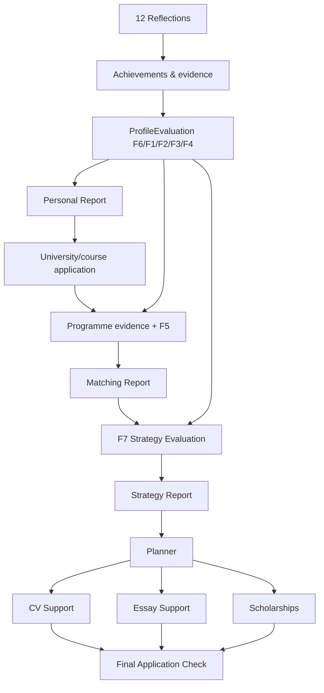
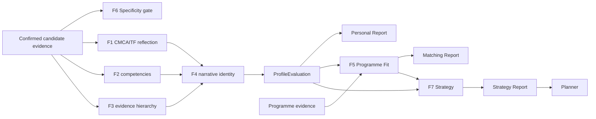

# GlowBal AI Strategy — canonical architecture

## Product model

GlowBal has one reusable student profile and multiple university/course applications.

## Ownership boundary

### User-level / reusable

- Reflection answers
- Achievements and activities
- Uploaded evidence
- Academic/test profile
- `ProfileEvaluation`
- Personal Report

Changing the target university/course does not create a second Personal Report.

### Application-level

- Target university/course
- Programme evidence profile
- F5 Programme Fit evaluation
- Matching Report
- F7 Strategy evaluation/report
- Planner tasks
- Application-specific CV/essay state where required
- Scholarship shortlist
- Final Application Check

## Evaluation pipeline

## Evidence contract

1. Applicant facts come from user/profile/document records.
2. Model extraction may propose semantic structure; factual extracted prose is source-grounded before scoring.
3. Observation, inference and missing data remain distinct.
4. Unsupported facts are converted to missing input, not quietly accepted.
5. Missing score dimensions are `null` and applicable weights are renormalized.
6. No Personal/Matching report produces an admission probability.
7. Every stored evaluation records an input hash, deterministic engine version and semantic extraction/prompt version.

## Personal Report

Canonical route: `/ai-strategy/personal-report`.

Canonical sections:

1. Core Identity
2. Driving Force
3. Signature Pattern
4. Emerging Themes
5. Personal Positioning
6. Proof of Me

The report is a rendering of stored `ProfileEvaluation`, not an independent source of truth.

`student_personal_reports` remains the one-row-per-user persistence seam. V2 stores:

- `structured_evaluation`
- `evaluation_engine_version`
- `prompt_version`
- `input_hash`
- `report_v2`
- generation metadata

## Matching Report

Canonical route: `/ai-strategy/[applicationId]/matching-report`.

The current route renders the existing Programme Fit implementation. The next product phase replaces the placeholder/legacy fit internals with the full F5 specification while retaining this canonical URL.

F5 must keep hard eligibility distinct from competitive assessment and keep Reach/Match/Safety primarily academic after hard filters.

## Strategy Report

Canonical route: `/ai-strategy/[applicationId]/strategy-report`.

The current report workspace remains functional for compatibility. The F7 rebuild will make structured profile + fit findings the inputs and produce traceable strategic objectives rather than reasoning from unrelated prose blobs.

Temporary compatibility: `applicant_analyses` is still generated internally because the current F7 route consumes it. It is not a user-facing Personal Report and should be removed once F7 reads the structured evaluation directly.

## Planner

Canonical route: `/ai-strategy/[applicationId]/planner`.

Strategy and Planner remain separate concepts:

- Strategy = why, what to improve, priority, sequencing and target state.
- Planner = executable tasks, dependencies, deadlines and completion evidence.

## Route model

`src/shared/lib/ai-strategy-route-model.ts` is the application navigation source of truth for the canonical journey.

Compatibility routes are documented in `docs/ai-strategy-route-audit.md` and should only shrink over time.

## Database deployment order

`supabase-shared-evaluation-engine.sql` is additive except that it relaxes V1-only NOT NULL constraints on the legacy Personal Report columns so V2 rows can be written without manufacturing a V1 payload.

Deploy the migration **before** application code that queries `report_v2` / `structured_evaluation` / `evaluation_engine_version`.

Existing V1 JSON is retained for rollback/history; it is no longer the canonical reader/writer.

## Next implementation phases

1. F5 Matching Report rebuild on this architecture.
2. F7 Strategy Report rebuild using structured gap/priority/intervention objects.
3. Strategy → Planner task contract and stale-analysis invalidation.
4. CV system merge: current UX + persisted structured backend.
5. Essay Support consolidation.
6. Scholarship Finder application integration.
7. Final Application Check framework.
