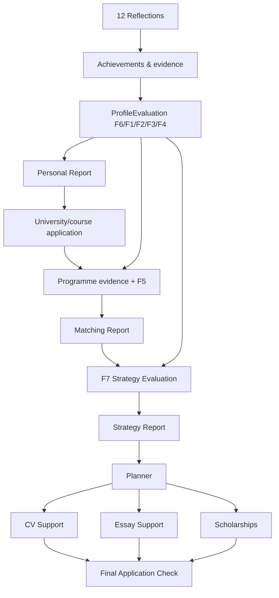
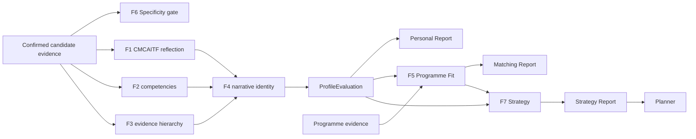

# GlowBal AI Strategy — canonical architecture

## Product model

GlowBal has one reusable student profile and multiple university/course applications.



## Ownership boundary

### User-level / reusable

- Reflection answers
- Achievements and activities
- Uploaded evidence
- Academic/test profile
- `ProfileEvaluation`
- Personal Report

Changing the target university/course does not create a second Personal Report.

### Application-level

- Target university/course
- Programme evidence profile
- F5 Programme Fit evaluation
- Matching Report
- F7 Strategy evaluation/report
- Planner tasks
- Application-specific CV/essay state where required
- Scholarship shortlist
- Final Application Check

## Evaluation pipeline



## Evidence contract

1. Applicant facts come from user/profile/document records.
2. Model extraction may propose semantic structure; factual extracted prose is source-grounded before scoring.
3. Observation, inference and missing data remain distinct.
4. Unsupported facts are converted to missing input, not quietly accepted.
5. Missing score dimensions are `null` and applicable weights are renormalized.
6. No Personal/Matching report produces an admission probability.
7. Every stored evaluation records an input hash, deterministic engine version and semantic extraction/prompt version.

## Personal Report

Canonical route: `/ai-strategy/personal-report`.

Canonical sections:

1. Core Identity
2. Driving Force
3. Signature Pattern
4. Emerging Themes
5. Personal Positioning
6. Proof of Me

The report is a rendering of stored `ProfileEvaluation`, not an independent source of truth.

`student_personal_reports` remains the one-row-per-user persistence seam. V2 stores:

- `structured_evaluation`
- `evaluation_engine_version`
- `prompt_version`
- `input_hash`
- `report_v2`
- generation metadata

## Matching Report

Canonical route: `/ai-strategy/[applicationId]/matching-report`.

The current route renders the existing Programme Fit implementation. The next product phase replaces the placeholder/legacy fit internals with the full F5 specification while retaining this canonical URL.

F5 must keep hard eligibility distinct from competitive assessment and keep Reach/Match/Safety primarily academic after hard filters.

## Strategy Report

Canonical route: `/ai-strategy/[applicationId]/strategy-report`.

The current report workspace remains functional for compatibility. The F7 rebuild will make structured profile + fit findings the inputs and produce traceable strategic objectives rather than reasoning from unrelated prose blobs.

Temporary compatibility: `applicant_analyses` is still generated internally because the current F7 route consumes it. It is not a user-facing Personal Report and should be removed once F7 reads the structured evaluation directly.

## Planner

Canonical route: `/ai-strategy/[applicationId]/planner`.

Strategy and Planner remain separate concepts:

- Strategy = why, what to improve, priority, sequencing and target state.
- Planner = executable tasks, dependencies, deadlines and completion evidence.

### Core 1 Assess foundation

Core 1 is a pure domain boundary, not a Planner writer:

```text
fetchPlanningContextSources()
  -> compilePlanningContext(sources)
  -> PlanningContext
  -> compileAssessments(context)
  -> AssessmentResult[]
```

The deterministic compiler reports requirement status, established evidence
absence/availability, existing evidence needing proof, known gaps, deadlines,
stored student constraints, and missing assessment information. Each result
keeps the provenance of its input (`user_provided`, `database_factual`,
`deterministically_derived`, `ai_generated`, or `unknown`), so an F5-derived
finding is not misrepresented as a deterministic fact.

`getApplicationAssessments(supabase, applicationId, userId)` is the small API
orchestration seam for this pipeline. Fetching and raw-row validation remain at
the adapter boundary; context and assessment compilation remain pure domain
functions. Deadline precedence is explicit (`course_application`, then
`university`, then `user`, then `other`), with equal-precedence conflicts
retained rather than silently selecting an arbitrary row.

It does not call AI, perform I/O, generate recommendations or tasks, schedule
work, or change Planner execution UI. Core 2 Decide and Core 3 Plan remain the
owners of choices and Phase -> Step -> Micro-step generation respectively.

### Core 2 Decide foundation

```text
AssessmentResult[] -> compileDecisions(assessments) -> DecisionResult[]
```

Core 2 is also pure and read-only. It can determine whether the current
application is blocked by a confirmed hard requirement, needs information, or
has no known hard blocker. It surfaces one or more non-blocking soft signals as
attention directions, deliberately returning `needs_user_choice` when no
deterministic rule selects among them. Explicit user constraints are retained
as comparison context but do not by themselves make an option feasible or
blocked without a comparable factual candidate value. F5-derived reasons stay
AI-generated throughout this boundary.

Core 2 does not create Planner tasks, phases, steps, micro-steps, schedules,
or writes. Core 3 Plan remains responsible for turning a chosen direction into
execution structure; Core 4's existing Planner execution foundation remains
separate.

`getApplicationDecisions(supabase, applicationId, userId)` is the Core 2
runtime seam. It composes `getApplicationAssessments()` exactly once and sends
the returned `AssessmentResult[]` unchanged to `compileDecisions()`; it does
not fetch sources again or add a public HTTP endpoint.

### Core 3 Plan foundation

```text
DecisionResult[] -> compilePlan(decisions) -> PlanResult
  Phase -> Step -> Micro-step
```

Core 3 is a pure, deterministic hierarchy scaffold only. It groups confirmed
blockers, required information, unresolved user choices, and the existing safe
available attention direction in that explicit order. Every node records its
source decision IDs and source provenances. Where structured product data does
not support detailed guidance, a micro-step is explicitly marked
`requires_enrichment` or `requires_user_input` rather than fabricating a
personal action, deadline, or choice.

This is intentionally separate from the flat persisted Planner
recommendations and F7's flat AI-authored `prioritize`/`avoid` roadmap.

`getApplicationPlan(supabase, applicationId, userId)` is the read-only Core 3
runtime seam. It composes `getApplicationDecisions()` once and passes the
returned decisions unchanged to `compilePlan()`; the single Core 1 source-fetch
chain is therefore reused rather than repeated.

### Core 3 -> Core 4 persistence bridge

The canonical persisted model is **Option B: dedicated hierarchy tables**:

```text
application_plans
  -> application_plan_phases
    -> application_plan_steps
      -> application_plan_micro_steps
```

Option A (extending `application_recommendations`) was rejected because it
would flatten the Phase -> Step -> Micro-step contract and repeat the current
F5/F7 shared-producer archive risk. Option C (one generic node table) was
rejected because the small fixed hierarchy benefits from explicit foreign keys,
type-specific constraints, and a single clear home for Core 4 execution fields.
The new tables are therefore not an alternate writer for the legacy flat
recommendations table.

`application_plans` has one active `core3_deterministic` row per application.
Its child rows use the deterministic Core 3 ID as `domain_node_id`, uniquely
within their parent. Regeneration reconciles only on that ID: it inserts new
nodes, updates planning-owned fields and ordering, restores a previously
archived node with the same identity, and archives absent nodes. It never title-
or category-matches and never hard-deletes a removed node. A separate plan-
version table is intentionally not introduced yet: a stable active root plus
archived node history is sufficient for deterministic regeneration; a future
auditable snapshot/version feature can be additive without changing identity.

Planning owns titles, objectives, readiness, ordering, provenance, source
decision IDs, and optional `content_schema`. Core 4 owns only micro-step
execution state: `status`, `deadline`, `content_value`, and
`execution_evidence`. Core 3's reconciliation never writes those fields, even
when planning definition/schema changes.

`syncApplicationPlan(supabase, applicationId, userId)` checks application
ownership, calls `getApplicationPlan()` once, reads only this producer's
hierarchy, runs pure `reconcilePlan()`, then applies dependency-ordered writes.
The Supabase JS client provides no multi-statement transaction primitive, so
each write is atomic and a failed partial sync is safely retried to convergence;
all writes remain application/user scoped. The migration is
`supabase-core3-plan-hierarchy.sql` and must be applied before enabling this
runtime path.

For local demonstration, an application without a canonical plan shows a
development-only **Generate canonical plan** button on its Planner page. It
posts to `/api/dev/applications/[id]/planner/sync`, requires an authenticated,
same-origin request, checks UUID/ownership through `syncApplicationPlan()`, and
returns 404 in production. This is bootstrap plumbing only, not a production
plan-generation trigger.

No Planner UI has been changed. The current Planner continues to read legacy
`application_recommendations`; a future UI adapter must read this hierarchy
without making it a second flat canonical model.

### Core 4 canonical Planner read model

```text
PlanResult
  -> persistence bridge
  -> application_plans / phases / steps / micro_steps
  -> getApplicationPlanner()
  -> buildPlannerReadModel()
  -> PlannerReadModel
       -> List: Phase -> Step -> Micro-step hierarchy
       -> Calendar: micro-steps with deadlines only
       -> Kanban: micro-steps grouped by status only
```

`getApplicationPlanner(supabase, applicationId, userId)` is the sole
read-only Core 4 boundary for the canonical hierarchy. It validates ownership,
loads the root and all hierarchy levels with bounded set queries (two queries
when no root exists; five for a populated plan), then passes explicit
persistence records to pure `buildPlannerReadModel()`. It never queries or
merges `application_recommendations`, so F5/F7 legacy semantics cannot be
mistaken for Core 3 work.

`PlannerReadModel` preserves the active hierarchy and exposes flat projections
only as derived execution views. Micro-step is the only node with execution
status, date-only deadline, content definition/value, and evidence. Step and
Phase progress are derived from active descendant micro-steps (`0/0 = 0%`),
never stored. Archived nodes and all descendants are excluded defensively;
orphaned, foreign, duplicate, and invalid-status rows are excluded or safely
normalised and appear as non-fatal diagnostics.

Temporary compatibility is **Strategy A**: canonical reads return an empty
model when an application has no persisted Core 3 plan. The existing legacy
Planner remains unchanged until a deliberate UI migration or backfill is
approved. There is no fake hierarchy and no implicit fallback merge.

The current task-detail route and recommendation PATCH/evidence endpoints are
legacy-only. A future Core 4 write stage should add micro-step-specific route
contracts using `PlannerMicroStep.id`; this read model already exposes that ID
alongside its deterministic `domainNodeId` and parent context.

### Core 4 execution integration

The active Planner route now selects deliberately between two non-merged data
models: an application with an active canonical plan renders
`HierarchicalApplicationPlanner`; an application with no plan keeps the legacy
recommendation Planner. The canonical client owns one `PlannerReadModel` state
for List, Calendar, and Kanban, so optimistic status/deadline edits update each
view and derived ancestor progress immediately.

Canonical execution writes use:

```text
PATCH /api/applications/[applicationId]/planner/micro-steps/[microStepId]
```

The endpoint verifies the full Micro-step -> Step -> Phase -> Plan -> owned
application chain, rejects archived/foreign rows, and allowlists only `status`,
date-only `deadline`, and `content_value`. It cannot change Core 3 hierarchy,
title, order, provenance, readiness, or `content_schema`. The canonical task
detail route is `/ai-strategy/[applicationId]/planner/tasks/[microStepId]`; it
uses the same update boundary and existing interactive content controls.

Calendar and Kanban render only Micro-steps. Native drag/drop remains available
on desktop; every Micro-step also has a status selector or date input, providing
a touch-safe/mobile fallback. Evidence values are read from
`execution_evidence`, but upload remains legacy-only because the current upload
relation is specifically keyed by `recommendation_id`; no polymorphic link was
introduced.

## Route model

`src/shared/lib/ai-strategy-route-model.ts` is the application navigation source of truth for the canonical journey.

Compatibility routes are documented in `docs/ai-strategy-route-audit.md` and should only shrink over time.

## Database deployment order

`supabase-shared-evaluation-engine.sql` is additive except that it relaxes V1-only NOT NULL constraints on the legacy Personal Report columns so V2 rows can be written without manufacturing a V1 payload.

Deploy the migration **before** application code that queries `report_v2` / `structured_evaluation` / `evaluation_engine_version`.

Existing V1 JSON is retained for rollback/history; it is no longer the canonical reader/writer.

## Next implementation phases

1. F5 Matching Report rebuild on this architecture.
2. F7 Strategy Report rebuild using structured gap/priority/intervention objects.
3. Strategy → Planner task contract and stale-analysis invalidation.
4. CV system merge: current UX + persisted structured backend.
5. Essay Support consolidation.
6. Scholarship Finder application integration.
7. Final Application Check framework.
