# GlowBal 90-Day SEO & GEO Content Strategy (2026)

## 1. Objective
Establish durable organic search visibility, high-intent student acquisition, and AI engine citations (ChatGPT, Perplexity, Claude, Google AI Overviews) for GlowBal in the study abroad and scholarship space for Vietnamese students.

---

## 2. The Four Content Pillars (Hub & Spoke Model)

```mermaid
graph TD
    Hub1[Pillar 1: International Scholarships]
    Hub1 --> S1[UK Scholarships for VN Students]
    Hub1 --> S2[Data Science Master Scholarships]
    Hub1 --> S3[Chevening & Government Grants]

    Hub2[Pillar 2: Costs, Visas & Living Planning]
    Hub2 --> S4[Cost of Studying in the UK 2026]
    Hub2 --> S5[Student Visa Requirements & Financial Proof]
    Hub2 --> S6[Budgeting & Part-time Work Regulations]

    Hub3[Pillar 3: University & Program Selection]
    Hub3 --> S7[Top Russell Group vs Non-Russell Fit]
    Hub3 --> S8[Computer Science Rankings vs Employment]
    Hub3 --> S9[Admissions Fit & Acceptance Rates]

    Hub4[Pillar 4: Application & Strategy Masterclasses]
    Hub4 --> S10[CV Building for Scholarship Committees]
    Hub4 --> S11[Personal Statement Framing & Evidence]
    Hub4 --> S12[Interview Preparation with Former Scholars]
```

### Pillar 1: Scholarships by Country, Level & Subject (High Search Intent)
- **Primary topics:**
  - Học bổng du học Anh cho sinh viên Việt Nam (Undergraduate & Postgraduate).
  - Học bổng ngành Data Science & AI bậc thạc sĩ.
  - Hướng dẫn xin học bổng toàn phần chính phủ (Chevening, Australia Awards, Fulbright).
- **Format:** Structured comparison tables, eligibility criteria, deadline timelines, official application links.

### Pillar 2: Study Costs, Living Expenses & Visas
- **Primary topics:**
  - Chi phí du học Anh thực tế theo vùng (London vs ngoài London).
  - Chứng minh tài chính visa du học Anh / Úc / Canada.
  - Kế hoạch tài chính 1 năm trước khi nộp đơn.
- **Format:** Cost breakdown calculators, expense tables, checklist hồ sơ visa.

### Pillar 3: University Comparisons & Admissions Fit
- **Primary topics:**
  - So sánh các trường đại học nhóm Russell Group theo học phí và cơ hội học bổng.
  - VinUniversity vs du học quốc tế: Đánh giá chi phí, học bổng và lộ trình.
  - Phân tích tỷ lệ chấp thuận (acceptance rate) và yêu cầu đầu vào theo GPA / IELTS.
- **Format:** Side-by-side matrices, entry score benchmarks, graduate outcome stats.

### Pillar 4: Application Strategy (CV, Personal Statement & Interview)
- **Primary topics:**
  - Cấu trúc CV chuẩn học thuật để xin học bổng.
  - Viết Personal Statement tạo điểm nhấn khác biệt cho hồ sơ học bổng.
  - Checklist 8 bước chuẩn bị hồ sơ từ 12 tháng trước deadline.
- **Format:** Step-by-step guides, sample templates, review checklists.

---

## 3. Editorial Quality & Publication Gate Requirements

Every published article in the GEO CMS must strictly satisfy:

1. **Direct Answer (GEO-First):** Provide a clear 40–60 word answer to the primary question in the first 2 paragraphs.
2. **Fact & Source Verification:** Every tuition fee, scholarship value, or visa deadline claim must cite an official government or university source.
3. **No Generator Placeholders:** Forbidden markers (`TODO_SOURCE_REQUIRED`, `A Glowbal draft guide`, `lorem ipsum`) are blocked at both read and publish boundaries.
4. **Internal Linking Graph (`geo_article_links`):**
   - Each spoke links to its parent pillar hub.
   - Each spoke links to at least 1 relevant university profile (`/universities/[id]`).
   - Call-to-action links to the public scholarship directory (`/scholarships`) or AI Strategy tool.
5. **Structured Schema:** Automatically carries `Article`, `BreadcrumbList`, and optional `FAQPage` JSON-LD.

---

## 4. 90-Day Rollout Schedule

| Phase | Duration | Output | Focus |
|---|---|---|---|
| **Phase 1** | Weeks 1–3 | 6 Foundation Articles | Top UK & US Scholarships, Cost of Study Breakdown |
| **Phase 2** | Weeks 4–6 | 6 Program Articles | STEM & Business Master Scholarships, Visa guides |
| **Phase 3** | Weeks 7–9 | 6 Strategy Guides | CV & Essay writing, Interview prep, Application timeline |
| **Phase 4** | Weeks 10–12 | Evaluation & Refresh | Review GSC impressions, CTR, position, update dates & expand |
